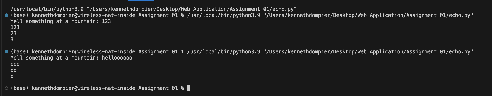
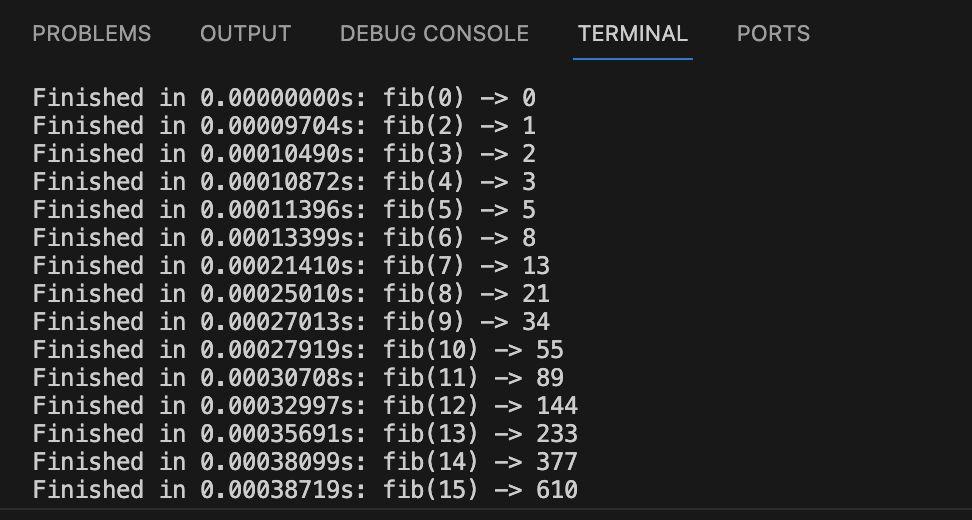
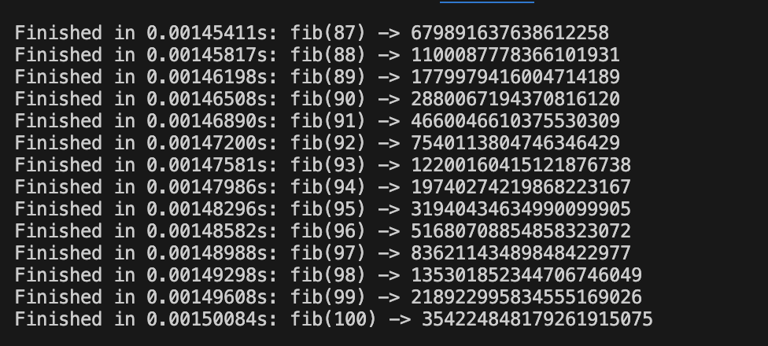

# CS-3980-Assignment-1

# Part 1

To replicate an echo, I have a for loop that takes i for within the range of the reptitions amonunt to 0. With this, the program gets the last three characters of the inputted string. The loop then returns a result string which progressively has less of the last three characters of the string since the i from the range gets progressively smaller from the loop.

# Part 2

For this program, I imported lru_cahce from functools, time for the timer, and matplotlib.pyplot for the graph. The basic fifibonacci sequence functions off a recursive function which checks if n <= 1. If n is 0 or 1, the function returns n because the Fibonacci sequence starts with 0 and 1, and the Fibonacci of 0 is 0, and the Fibonacci of 1 is 1. If n is greater than 1, the function calculates the Fibonacci number for n by recursively calling itself with fib(n-1) and fib(n-2) and adding them together. As it does this, it also begins and ends a timer, which gets printed and added to a timing_data list which gets used for the plot. This timer process begins with the timer function above the fib function, which gets called by the @timer decorator and takes the fib function as a function to record the time of.  

The Y-Axis, or Elasped Time(s) is how long it took for the code to finish equating each number from the fibanachi sequence. The X-Axis is a representation of each iteration of the fibanichi sequence being performed by the code. On the axis it counts up by multiples of 20 while each indivdual dot on the graph is a representation of each of the 100 times the sequence is performed. As it can be seen from the graph, there is a steady rise and a sharp incraese in how long it took the code to finish the sequence around iteration 40.
