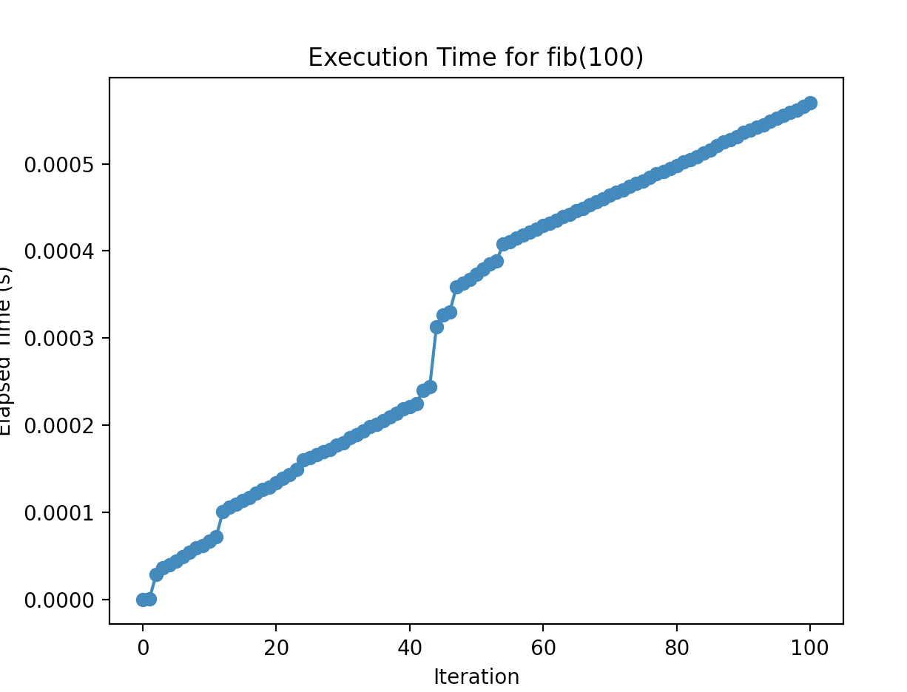

# CS-3980-Assignment-1

The Y-Axis, or Elasped Time(s) is how long it took for the code to finish equating each number from the fibanachi sequence. The X-Axis is a representation of each iteration of the fibanichi sequence being performed by the code. On the axis it counts up by multiples of 20 while each indivdual dot on the graph is a representation of each of the 100 times the sequence is performed. As it can be seen from the graph, there is a steady rise and a sharp incraese in how long it took the code to finish the sequence around iteration 40.
